### Hi there 👋, I'm com-wuqi

<!-- 动态打字效果 -->

---

### 🧑‍💻 About Me
- 🔭 I’m currently working on ** ... **
- 🌱 I’m currently learning **新技术**
- 👯 I’m looking to collaborate on **开源项目**
- 💬 Ask me about **技术/兴趣**
- 📫 How to reach me: [Email](mailto:2025214516@ecut.edu.cn) 
- ⚡ Fun fact: **这个家伙代码水平不高**

---

### 🛠️ Languages and Tools

---
### 📊 GitHub Stats
<!-- 统计卡片 - 支持深色/浅色自动切换 -->

  <picture>
    <source media="(prefers-color-scheme: dark)" 
            srcset="./profile/stats-dark.svg" />
    <source media="(prefers-color-scheme: light)" 
            srcset="./profile/stats-light.svg" />
    
  </picture>

<!-- 语言分布卡片 -->

  <picture>
    <source media="(prefers-color-scheme: dark)" 
            srcset="./profile/top-langs-dark.svg" />
    <source media="(prefers-color-scheme: light)" 
            srcset="./profile/top-langs-light.svg" />
    
  </picture>

---

### A snake here
<picture>
  <source media="(prefers-color-scheme: dark)" srcset="https://raw.githubusercontent.com/com-wuqi/com-wuqi/output/github-snake-dark.svg" />
  <source media="(prefers-color-scheme: light)" srcset="https://raw.githubusercontent.com/com-wuqi/com-wuqi/output/github-snake.svg" />
  
</picture>

---

### 📈 Visitor Count

